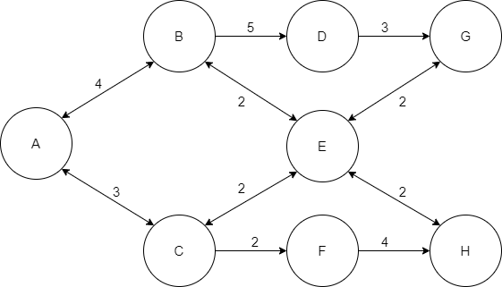

Shortest Path Tree Problem
==========================
The Shortest Path Problem minimizes the weighted distance from one source
node to one destination node.  This module's implementation is actually the
Shortest Path Tree Problem, which solves the Shortest Path Problem for every
possible destination node from a single source node.

An example network is shown below.  The arc lengths are shown
as well, which can be interpreted as the cost of traveling an arc.
Note that this graph is fully connected - there must be a possible path to 
every other node from the source node given.

Algorithm
---------
Dijkstra's algorithm finds an optimal solution to the shortest path tree problem
as long as all of the weighted distances (costs of traveling an arc) are
nonnegative.  

Initially, let the set :math:`S = \{s\}` and let :math:`\alpha_s = 0`.

Repeat until :math:`\bold{S}` is the set of all nodes reachable by the source node:

    Find an arc :math:`k(i, j)` that passes from a solved node to an unsolved node such that:

:math:`k(i, j) = \text{argmin}\{\alpha_i^' + c_k^' : k^'(i^', j^') 
       \in \bold{A}, i^' \in \bold{S}, j^' \in \bold{\bar{S}}`

Add node :math:`j` and arc :math:`k(i, j)` to the tree.  Add node :math:`j` to the solved
set :math:`\bold{S}`.  Let :math:`\alpha_j = \alpha_i + c_k`, where :math:`k \equiv k(i, j)`.

API Reference
-------------
See the corresponding section in the :ref:`api_reference` to learn more
about how to use the API for this problem class.